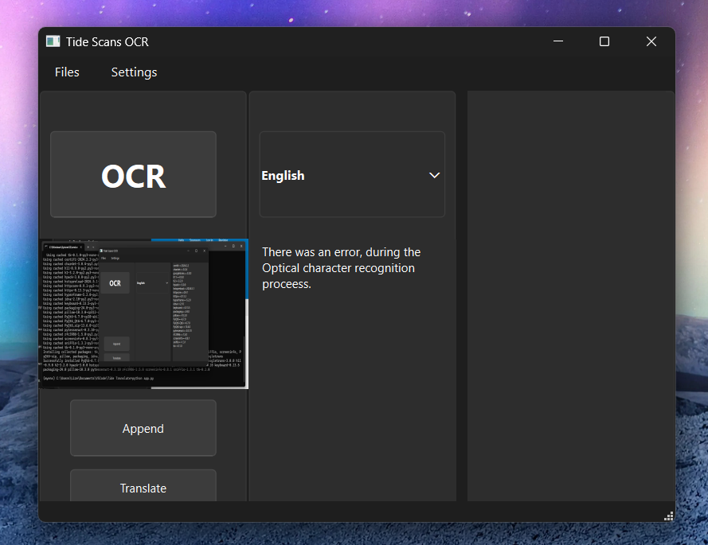

# OCR Application


This OCR (Optical Character Recognition) application allows you to recognize text from your primary monitor and perform various operations on it, including translation, appending text with numbering, and file operations. The application includes both a GUI and global hotkeys for ease of use.

## Features

- **Select Primary Monitor for OCR**: Choose the primary monitor to use for OCR operations.
- **OCR Button and Hotkey**: Perform OCR using a button in the GUI or the global hotkey `Ctrl+Shift+A`.
- **Append Text**: Append recognized text using the "Append" button or the global hotkey `Ctrl+Shift+Z`.
- **Translate OCR Text**: Translate the OCR text into English.
- **Manage Hotkeys**: Enable/disable global hotkeys and change the hotkey settings.
- **Numbering**: Add a number next to every appended text. This feature can be enabled or disabled.
- **File Operations**: Create, open, save, and save files as new files.
- **Settings Persistence**: Settings do not save between sessions, requiring manual reconfiguration each time.

## Supported OCR Languages

- **English**
- **Japanese**
- **Chinese**

### Adding More Languages

You can add more languages for OCR by downloading the appropriate language data files from the Tesseract OCR project. Follow these steps:

1. Visit the [Tesseract OCR Data Files](https://github.com/tesseract-ocr/tessdoc/blob/main/Data-Files.md) page.
2. Download the desired language data file (`.traineddata`).
3. Place the downloaded file in your Tesseract `tessdata` directory.

## Requirements

Install the required dependencies using the `requirements.txt` file:

```sh
pip install -r requirements.txt

## To Run it

To run the program you just need to use app.py

python app.py